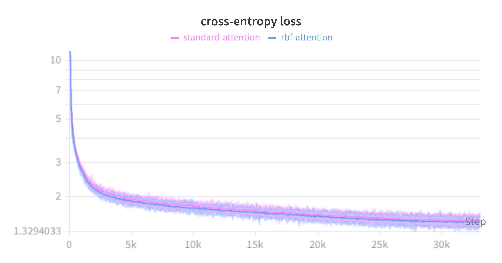

# RBF-Attention

A quick experiment swapping out the standard Scaled Dot-Product Attention (SDPA) in Transformers for a distance-based metric: the negative Radial Basis Function (RBF) kernel.

Basically, what happens if queries and keys attend to each other based on their squared Euclidean distance instead of a dot product? 

**Read the full deep-dive on my blog:** [Scaled RBF Attention: Trading Dot Products for Euclidean Distance](https://pisoni.ai/posts/scaled-rbf-attention/)

I ran a small-scale test using the [TinyStories](https://arxiv.org/abs/2305.07759) dataset. It actually converged and performed slightly better than standard SDPA in this constrained setup. Since computing exact pairwise distances is usually a performance killer, I also put together a custom fused Triton kernel to keep it practical to train.  


## The Math Trick

At first glance, calculating the exact pairwise Euclidean distance between all queries and keys sounds like a massive bottleneck compared to a highly optimized matrix multiplication. 

But if you expand the squared distance polynomial, you get:

$$-||q - k||^2 = -||q||^2 + 2(q \cdot k) - ||k||^2$$

In a Transformer, we apply a `softmax` over the key dimension to get attention weights. Because softmax is translation invariant ($\text{softmax}(x + c) = \text{softmax}(x)$), the $-||q||^2$ term (which is a constant for any given query across all its keys) completely cancels out.

This leaves us with a mathematically equivalent, much simpler formulation:

$$\text{softmax}(-\gamma ||q - k||^2) \equiv \text{softmax}\big(2\gamma(q \cdot k) - \gamma||k||^2\big)$$

**What this means:** RBF Attention is mathematically just standard dot-product attention with a built-in $L_2$ penalty on the keys. It naturally acts as a geometric regularizer, penalizing outlier keys from growing massive norms and hoarding all the attention (acting as "attention sinks").

## Architectural Adjustments for RBF

Distance-based attention inherently changes how vectors interact compared to dot products, which required two main architectural tweaks:

1. **Subspace Sinusoidal Embeddings (SuSiE)**: Standard RoPE interferes poorly with distance-based metrics because rotations alter relative Euclidean distances in unintended ways. Instead, this repo defaults to SuSiE for the RBF variants, using unrotated sinusoids with a learnable scale parameter (`pos_weight`) to allow semantic similarity to dominate early in training.
2. **Register Tokens**: To give the model a safe place to "look away", we prepend learned Register Tokens to the sequence. For RBF attention, these are carefully zero-initialized to ensure proper distance centering ($||q - 0||^2 = ||q||^2$) and avert dead gradients early in training.

## Triton Implementation & Non-Softmax Variants

Even with the math trick, doing this naively in PyTorch requires materializing the full $N \times N$ attention matrix just to subtract the key norms before the softmax. That instantly chokes memory bandwidth and causes OOMs on longer sequences.

To fix this, I wrote custom fused kernels (`rbf_attention.py`), borrowing heavily from FlashAttention:
1. It computes the $Q K^T$ block using fast hardware Tensor Cores.
2. It computes and subtracts the squared $L_2$ norms of the keys ($||k||^2$) directly in SRAM.
3. It applies the scaling and softmax, multiplies by $V$, and then writes the result back to global memory.

*(You can run `test_equivalence.py` and `rbf_math_test.py` to verify that the PyTorch math and the Triton kernel match exactly).*

**Experimental Non-Softmax Kernel:** The codebase also includes `TritonNonSoftmaxRBFAttention`, which completely removes the softmax denominator and relies purely on the bounding properties of the RBF exponential (since distances are strictly $\leq 0$).

## Results

I trained a small causal language model from scratch on TinyStories to compare standard SDPA with this RBF variant.

**Training** The RBF model converged slightly faster and hit a lower validation loss.  


*(Note: A detailed comparison of Train/Val losses is also available in `outputs/loss_plot.png`)*

**Attention Maps**
You can see a noticeable difference in how the regularized attention distributes across the tokens.  


**Profiling** Thanks to the Triton kernel, the forward/backward pass speeds and memory footprint are pretty competitive with PyTorch's native SDPA.  


## Try it out

```bash
# install dependencies
pip install -r requirements.txt

# verify math and kernel correctness
python test_equivalence.py
python rbf_math_test.py

# run triton benchmarks
python rbf_attention.py

# train and compare standard vs rbf models
python train_rbf_transformer.py
```

## Caveats & Next Steps
This is mostly just a fun proof-of-concept. A few obvious limitations:
- **Scale**: TinyStories is a tiny dataset with short context lengths. I have no idea if this key-norm regularization helps at the 1B+ parameter scale, or if it just restricts the model's ability to store massive amounts of world knowledge.
- **Inference**: I haven't adapted the Triton kernel for generative inference or KV-cache updating yet.

If anyone wants to try plugging this into a larger pre-training run or knows how to squeeze more performance out of the Triton kernel, let me know! Issues and PRs are welcome.