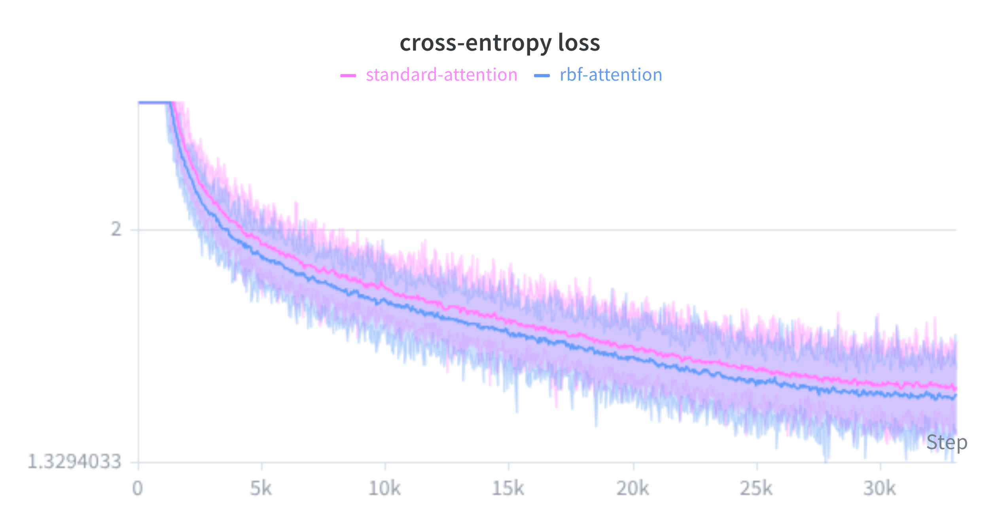
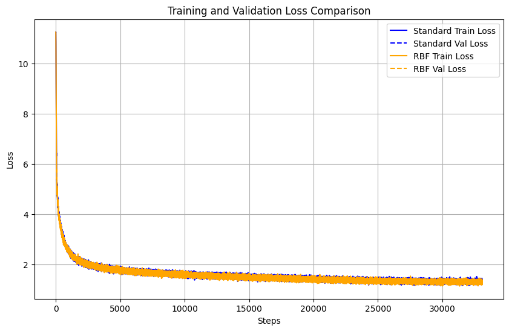
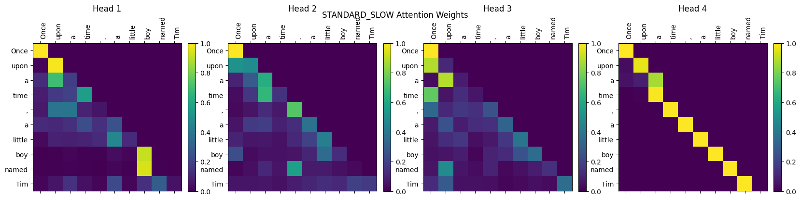
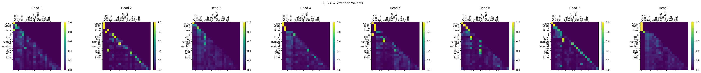
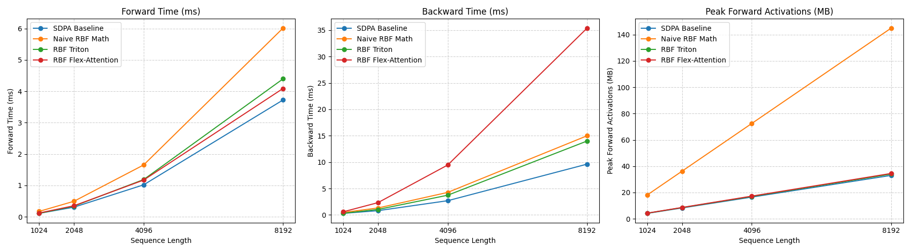

# RBF Attention: An Experiment in Distance-Based Attention

This repository contains a small research experiment: replacing the standard Scaled Dot-Product Attention (SDPA) in Transformers with a distance-based metric—specifically, the negative Radial Basis Function (RBF) kernel.

Instead of measuring similarity via the dot product of queries and keys, what if they attended to each other based on their squared Euclidean distance? 

I tested this idea on a small scale using the [TinyStories](https://arxiv.org/abs/2305.07759) dataset. Surprisingly, it converged smoothly and performed slightly better than standard SDPA in this simple setup. To make this actually practical to train without tanking performance, I also wrote a custom fused Triton kernel.  

## 🧮 The Math: Why this isn't incredibly slow

At first glance, calculating the exact pairwise Euclidean distance between all queries and keys sounds like a memory and performance nightmare compared to a highly optimized matrix multiplication. 

But if we expand the squared distance polynomial, a really nice mathematical trick emerges:

$$ -||q - k||^2 = -||q||^2 + 2(q \cdot k) - ||k||^2 $$

In a Transformer, we apply the `softmax` function over the key dimension to get our attention weights. A helpful property of softmax is that shifting all inputs by a constant doesn't change the output distribution ($\text{softmax}(x + c) = \text{softmax}(x)$). 

Because the $-||q||^2$ term is constant for any given query across all its keys, **the query norm completely cancels out of the softmax.**

This leaves us with a mathematically equivalent formulation:

$$ \text{softmax}(-\gamma ||q - k||^2) \equiv \text{softmax}\big(2\gamma(q \cdot k) - \gamma||k||^2\big) $$

**The Intuition:** This means RBF Attention is mathematically identical to standard dot-product attention, just with a built-in $L_2$ penalty applied to the keys (the $-||k||^2$ term). In standard attention, outlier keys can sometimes grow massive norms to dominate the attention distribution (acting as "attention sinks"). This RBF formulation acts as a geometric regularizer, naturally preventing any single key from unfairly hoarding attention simply by having a huge magnitude.

## ⚙️ The Engineering: Making it fast with Triton

While the math trick above saves us from calculating pure pairwise distances, doing this naively in PyTorch still requires materializing the full $N \times N$ attention matrix to subtract the key norms before the softmax. This causes immediate memory bandwidth bottlenecks and OOMs on longer sequences.

To fix this, I wrote a custom fused kernel in Triton (`triton_rbf_attention.py`), taking heavy inspiration from FlashAttention:
1. It computes the $Q K^T$ block using fast hardware Tensor Cores.
2. It computes and subtracts the squared $L_2$ norms of the keys ($||k||^2$) directly in SRAM.
3. It applies the scaling and softmax, then multiplies by $V$ before writing the result back to global memory.

*(You can verify that the pure math, the PyTorch implementation, and the Triton kernel are all numerically identical by running `test_equivalence.py` and `rbf_math_test.py`).*

## 📊 Initial Results

I trained a small causal language model from scratch on TinyStories to compare standard SDPA against this RBF implementation.

**1. Training Convergence**  
In this limited setting, the RBF attention model converged a bit faster and reached a slightly lower validation loss.  

**2. Attention Maps:**
You can see how the regularized attention distribution differ between standard attention and rbf attention.  

**3. Kernel Profiling**  
Thanks to the Triton implementation, the memory footprint stays low, and the forward/backward pass speeds are highly competitive with PyTorch's native and super-optimized SDPA.  

## 📂 Repository Structure

* `rbf_mha.py`: The PyTorch `nn.Module` implementation of RBF Multi-Head Attention.
* `triton_rbf_attention.py`: The optimized, fused Triton kernel.
* `test_equivalence.py` & `rbf_math_test.py`: Unit tests proving mathematical and numerical equivalence.
* `profile_attention.py`: Benchmarking script comparing speed and memory usage.
* `main.py` & `distributed.py`: The training script and DDP setup for the TinyStories experiment.

## ⚠️ Caveats & Future Work

While these results are a really fun proof-of-concept, I want to be upfront about the limitations:
* **Scale:** TinyStories is a small dataset with short context lengths. It remains to be seen if the regularizing effect of the key-norm penalty continues to be beneficial at the 1B+ parameter scale, or if it actually restricts the model's expressivity when dealing with massive amounts of world knowledge.
* **Inference:** Adapting the Triton kernel to efficiently handle generative inference and KV-cache updating is beyond the current scope of this repo.

If anyone wants to try plugging this into a larger pre-training run, or has ideas on how to squeeze more FLOPs out of the Triton kernel, I'd love to hear how it goes! Feel free to open an issue or reach out.